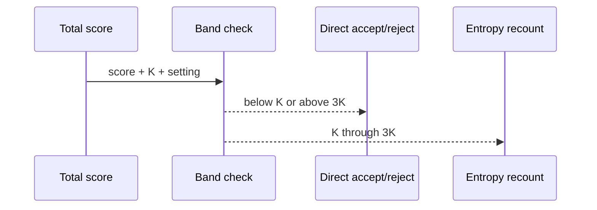
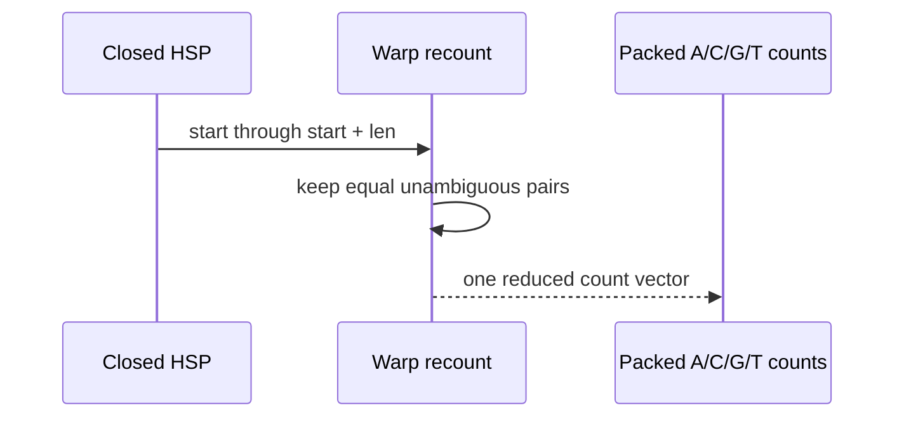
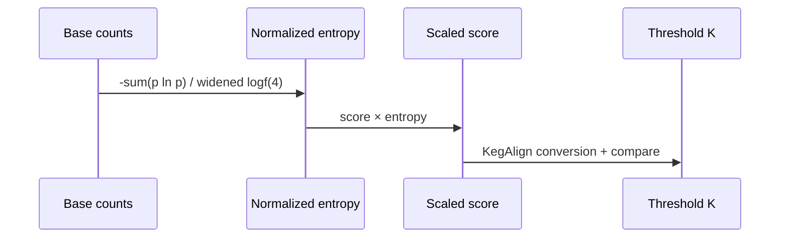

# Apply entropy only where it can matter

<!-- @source: src/gpu/kernels.rs::find_hsps -->
<!-- @source: src/gpu/mod.rs::LOG4 -->

## F.1 — Enter the narrow entropy band
<!-- @id: f-band -->
WHAT GOES IN: Exact X-drop total score, threshold K, and the `--noentropy` setting.
WHAT HAPPENS: Scores from K through 3K enter entropy correction; higher scores bypass it and lower scores fail.
WHAT COMES OUT: A direct decision or one interval requiring composition counts.
INVARIANT: The band is closed at both K and 3K, matching KegAlign.

## F.2 — Recount matching unambiguous bases
<!-- @id: f-recount -->
WHAT GOES IN: The closed HSP interval selected by the X-drop maxima.
WHAT HAPPENS: The warp revisits the interval and counts matching A, C, G, and T pairs in four packed fields.
WHAT COMES OUT: Four base-composition counts and their total.
INVARIANT: Mismatches, ambiguous symbols, softmask symbols, and positions beyond either maximum do not count.

## F.3 — Reproduce KegAlign's float boundary
<!-- @id: f-threshold -->
WHAT GOES IN: Total score, composition counts, and `logf(4)` widened to double.
WHAT HAPPENS: Normalized entropy scales the score, then the result follows KegAlign's conversion points before comparison with K.
WHAT COMES OUT: An accepted entropy-adjusted score or rejection.
INVARIANT: Replacing widened `logf(4)` or the score conversions with mathematically cleaner doubles can change boundary cases.

