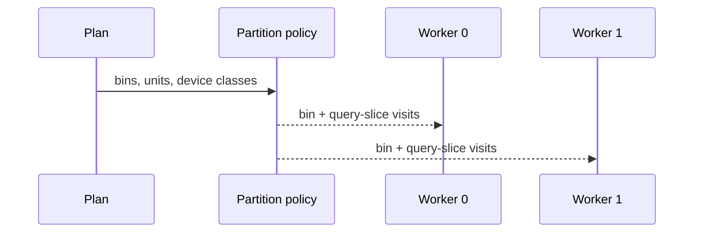
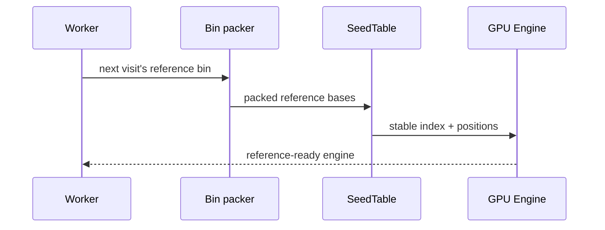
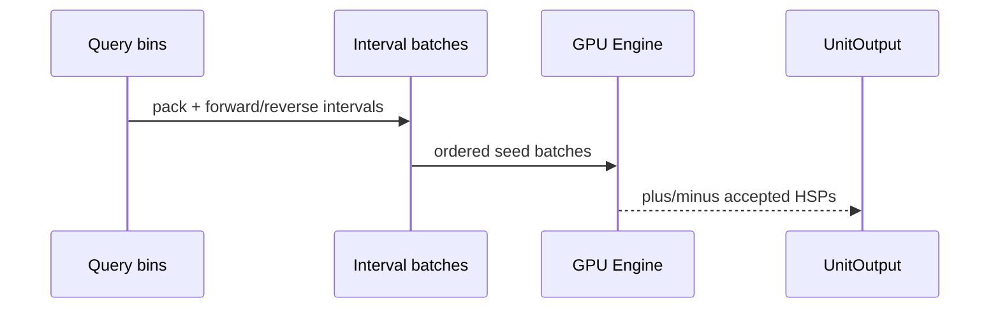
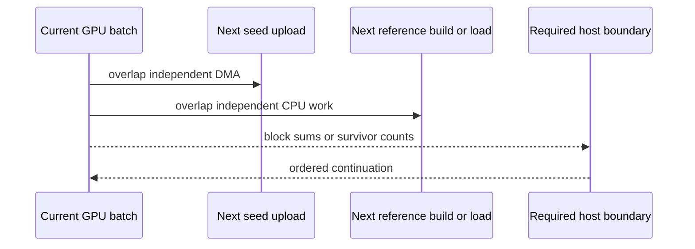
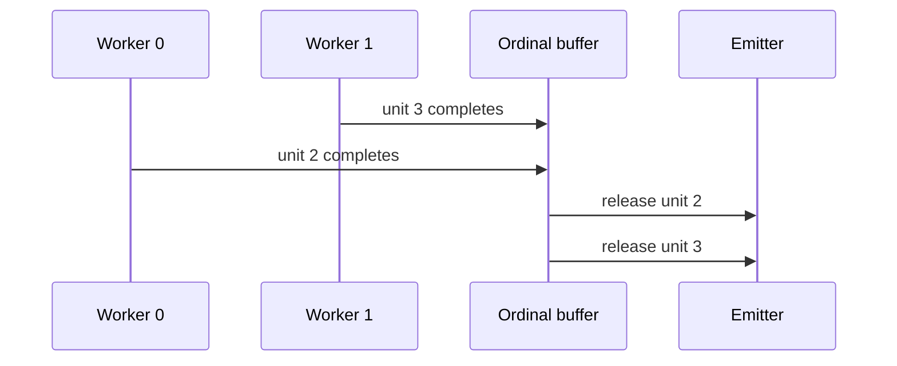

# Deterministic parallel execution

<!-- @source: src/plan.rs::assign_bins -->
<!-- @source: src/plan.rs::unit_partition -->
<!-- @source: src/run.rs::partition_policy -->
<!-- @source: src/run.rs::run_bins -->
<!-- @source: src/run.rs::seed_and_filter_all -->
<!-- @source: src/run.rs::UnitOutput -->
<!-- @source: src/run.rs::Emitter::emit_unit -->

## H.1 — Assign whole bins or unit slices
<!-- @id: h-assign -->
WHAT GOES IN: Planned reference bins and work units, the worker count, and the class of every device the run uses.
WHAT HAPPENS: On matching dedicated devices, count quotas give each worker whole bins first, then contiguous query slices; otherwise the longest bins go to the currently lightest worker. Ties break deterministically.
WHAT COMES OUT: One ordered list of visits per worker, each a reference bin and a slice of its query bins.
INVARIANT: Every WorkUnit has exactly one owner; a bin split across workers costs an extra reference build, never a different unit.

## H.2 — Build reference-scoped state once per visit
<!-- @id: h-reference-state -->
WHAT GOES IN: One worker's next visit: a reference bin and its records, or that bin's arrays in an `hspZ index`.
WHAT HAPPENS: The worker packs the bin and builds its stable SeedTable, or loads both from the index, then creates an Engine and uploads reference-scoped buffers.
WHAT COMES OUT: One initialized GPU engine ready for every query bin of the visit.
INVARIANT: Builds plus index loads, engine creations, and reference uploads each equal the visit count, which is the bin count under whole-bin ownership.

## H.3 — Reuse the engine across query work
<!-- @id: h-query-work -->
WHAT GOES IN: One reference-ready Engine and the visit's query bins (every planned query bin under whole-bin ownership).
WHAT HAPPENS: Each query bin is packed, reverse-complemented, split into intervals and batches, then run on both requested strands.
WHAT COMES OUT: One completed Pass for each reference-bin × query-bin WorkUnit.
INVARIANT: WorkUnits execute in the plan's query-bin order within each visit; with `--query-list`, jobs follow list order inside each bin.

## H.4 — Overlap only order-neutral work
<!-- @id: h-overlap -->
WHAT GOES IN: The current GPU batch and the next query-seed or reference-bin preparation.
WHAT HAPPENS: Seed upload and the next visit's reference build or index load can overlap current kernels; host dependencies still synchronize at count boundaries.
WHAT COMES OUT: Less exposed host/copy time without changing the batch sequence.
INVARIANT: Overlap never reorders MAX_HITS chunks, survivor compaction, or returned HSP vectors.

## H.5 — Replay results by ordinal
<!-- @id: h-replay -->
WHAT GOES IN: UnitOutputs arriving from workers in arbitrary completion order.
WHAT HAPPENS: The coordinator buffers results by WorkUnit ordinal and releases only the next expected unit to the emitter (one per job with `--query-list`); a duplicate or out-of-plan unit is an error.
WHAT COMES OUT: Deterministic partition history, filenames, tar entry order, and output bytes.
INVARIANT: GPU completion order is never observable in the emitted segment set.

