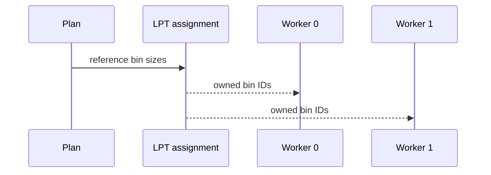
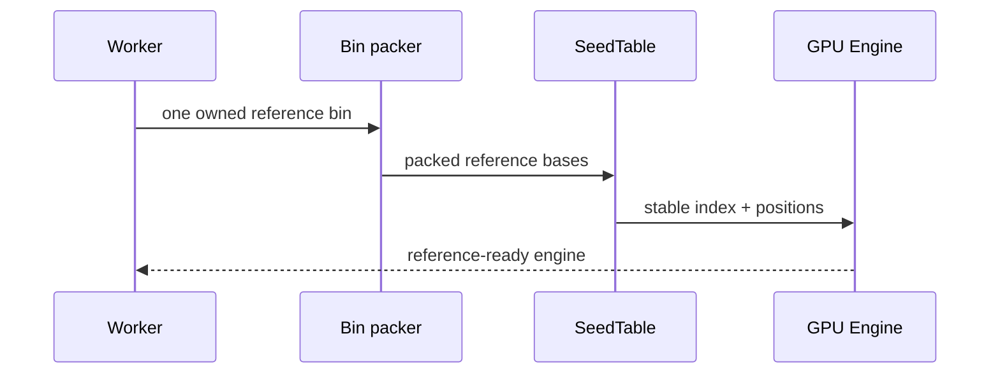
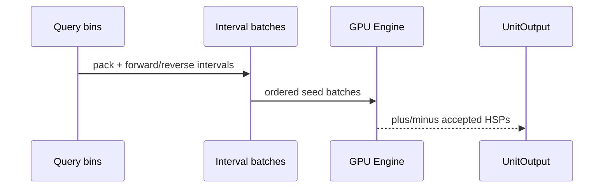
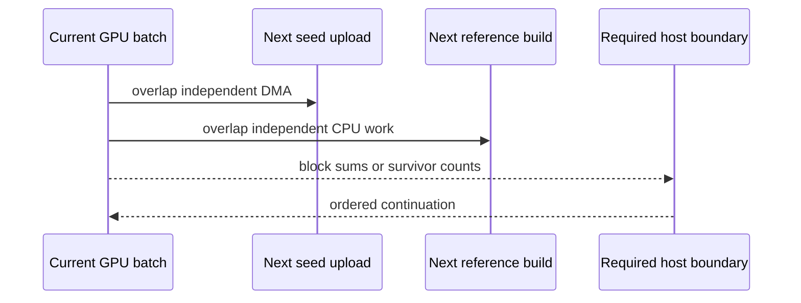
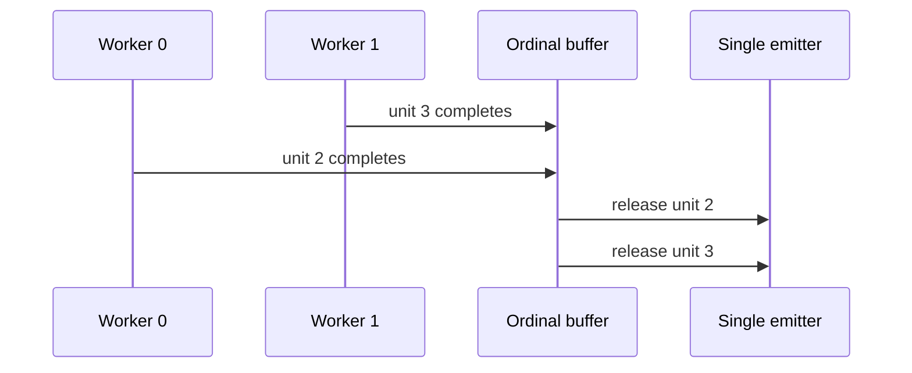

# Deterministic parallel execution

<!-- @source: src/plan.rs::assign_bins -->
<!-- @source: src/run.rs::run_bins -->
<!-- @source: src/run.rs::seed_and_filter_all -->
<!-- @source: src/run.rs::UnitOutput -->
<!-- @source: src/run.rs::Emitter::emit_unit -->

## H.1 — Assign complete reference bins
<!-- @id: h-assign -->
WHAT GOES IN: Planned reference bins and the requested worker count.
WHAT HAPPENS: Longest bins are assigned to the currently lightest worker, with deterministic tie-breaks.
WHAT COMES OUT: One ordered list of reference-bin IDs per worker.
INVARIANT: A reference bin has exactly one owner and is never split across workers.

## H.2 — Build reference-scoped state once
<!-- @id: h-reference-state -->
WHAT GOES IN: One worker's next reference bin and its records.
WHAT HAPPENS: The worker packs the bin, builds its stable SeedTable, creates an Engine, and uploads reference-scoped buffers.
WHAT COMES OUT: One initialized GPU engine ready for every query bin against that reference bin.
INVARIANT: Seed-table build, engine creation, and reference upload each occur once per reference bin.

## H.3 — Reuse the engine across query work
<!-- @id: h-query-work -->
WHAT GOES IN: One reference-ready Engine and every planned query bin.
WHAT HAPPENS: Each query bin is packed, reverse-complemented, split into intervals and batches, then run on both requested strands.
WHAT COMES OUT: One completed Pass for each reference-bin × query-bin WorkUnit.
INVARIANT: WorkUnits execute in the plan's query-bin order within each owned reference bin.

## H.4 — Overlap only order-neutral work
<!-- @id: h-overlap -->
WHAT GOES IN: The current GPU batch and the next query-seed or reference-bin preparation.
WHAT HAPPENS: Seed upload and next-reference CPU construction can overlap current kernels; host dependencies still synchronize at count boundaries.
WHAT COMES OUT: Less exposed host/copy time without changing the batch sequence.
INVARIANT: Overlap never reorders MAX_HITS chunks, survivor compaction, or returned HSP vectors.

## H.5 — Replay results by ordinal
<!-- @id: h-replay -->
WHAT GOES IN: UnitOutputs arriving from workers in arbitrary completion order.
WHAT HAPPENS: The coordinator buffers results by WorkUnit ordinal and releases only the next expected unit to the single emitter.
WHAT COMES OUT: Deterministic partition history, filenames, tar entry order, and output bytes.
INVARIANT: GPU completion order is never observable in the emitted segment set.

