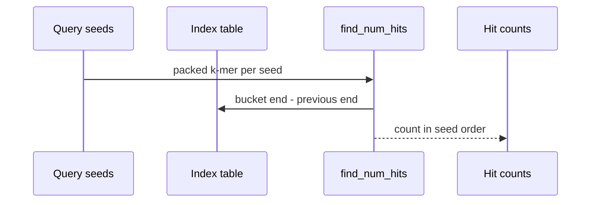
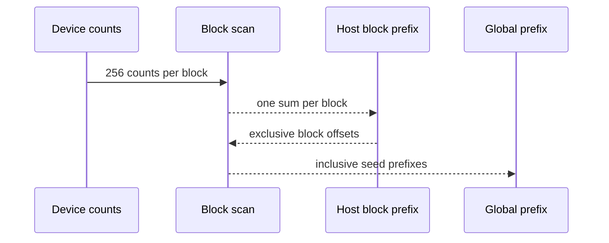
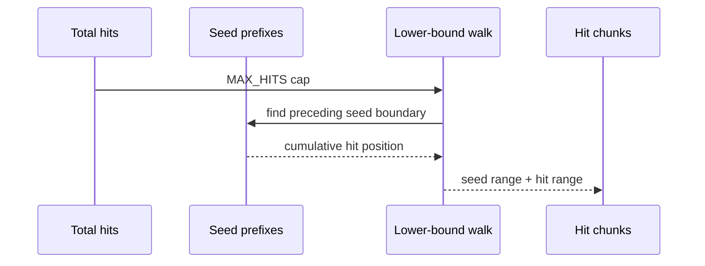
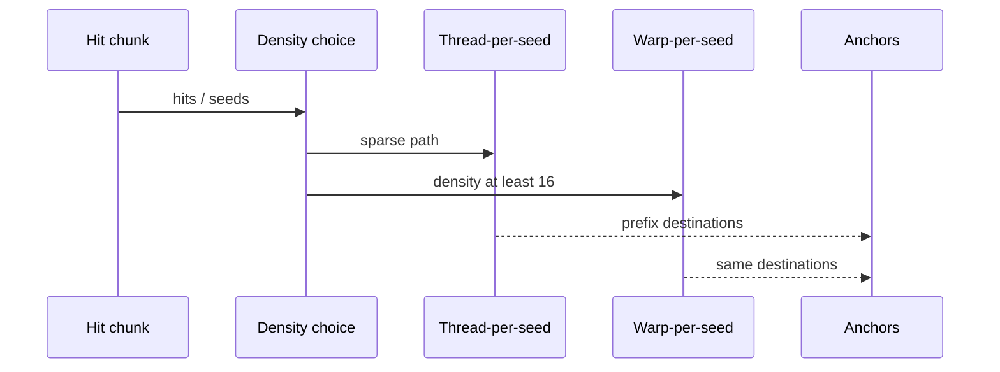
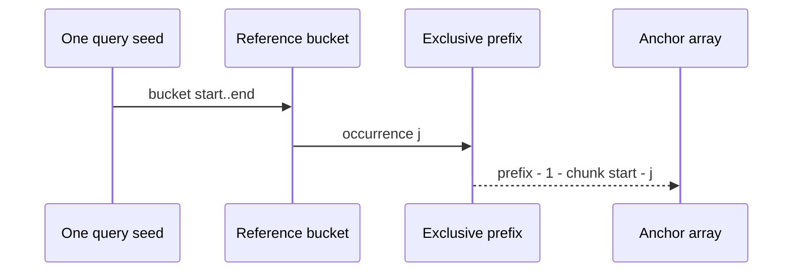

# Query seeds become ordered anchors

<!-- @source: src/gpu/kernels.rs::find_num_hits -->
<!-- @source: src/gpu/kernels.rs::scan_blocks -->
<!-- @source: src/gpu/mod.rs::chunk_limits -->
<!-- @source: src/gpu/kernels.rs::find_hits_dense -->
<!-- @source: src/gpu/kernels.rs::find_hits_dense_warp -->

## C.1 — Count each seed's reference occurrences
<!-- @id: c-count-hits -->
WHAT GOES IN: Query seed offsets and the reference index table.
WHAT HAPPENS: `find_num_hits` subtracts adjacent cumulative bucket ends for each seed.
WHAT COMES OUT: One reference-hit count per query seed.
INVARIANT: Empty buckets contribute zero without changing seed order.

## C.2 — Turn counts into global prefixes
<!-- @id: c-scan-hits -->
WHAT GOES IN: Per-seed hit counts on the device.
WHAT HAPPENS: Device blocks scan locally, the host exclusively scans small block sums, then offsets are added back.
WHAT COMES OUT: A global inclusive prefix and the total number of anchors.
INVARIANT: Only block sums cross the bus unless MAX_HITS actually forces element-level chunking.

## C.3 — Cut at MAX_HITS boundaries
<!-- @id: c-chunks -->
WHAT GOES IN: Global hit prefixes, total hits, and the resolved MAX_HITS cap.
WHAT HAPPENS: The common case uses one chunk; oversized streams reproduce KegAlign's lower-bound walk over seed prefixes.
WHAT COMES OUT: Contiguous seed ranges and their exact hit ranges.
INVARIANT: A seed is never split across chunks, so a chunk may exceed MAX_HITS by one seed bucket.

## C.4 — Choose sparse or dense expansion
<!-- @id: c-mapping -->
WHAT GOES IN: One chunk's seed count and hit count.
WHAT HAPPENS: Sparse launches assign one thread per seed; at 16 or more hits per seed, one warp walks a seed bucket coalescently.
WHAT COMES OUT: The same packed anchors under either execution mapping.
INVARIANT: Mapping changes memory traffic, not prefix-derived destinations.

## C.5 — Expand buckets backwards
<!-- @id: c-expand -->
WHAT GOES IN: Seed prefixes, reference bucket positions, query positions, and chunk offsets.
WHAT HAPPENS: Every reference occurrence becomes a packed anchor written backwards from that seed's exclusive prefix.
WHAT COMES OUT: An anchor array in the raw order expected by the oracle.
INVARIANT: Reversing the per-seed bucket walk is load-bearing because this order feeds later MAX_HITS and dedup scopes.

