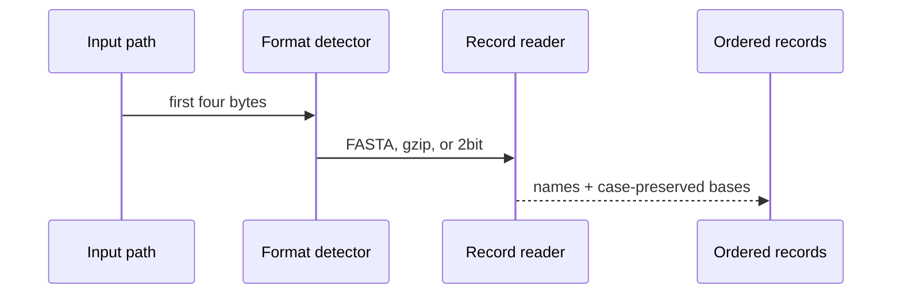
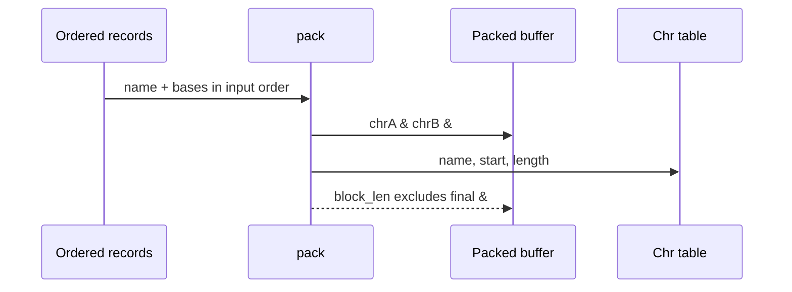
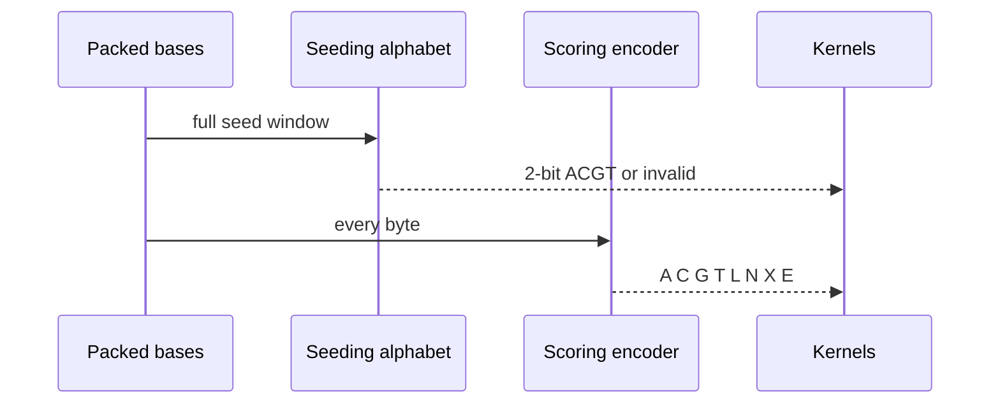
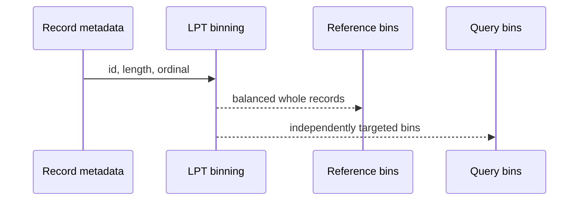
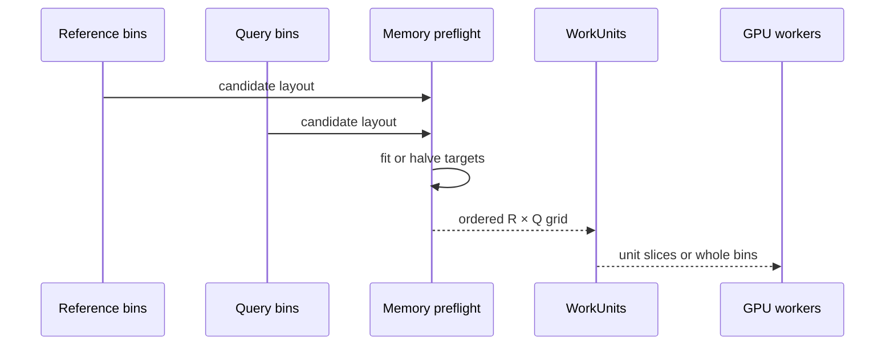

# Input records become deterministic work

<!-- @source: src/sequence.rs::read_records -->
<!-- @source: src/sequence.rs::pack -->
<!-- @source: src/sequence.rs::encode -->
<!-- @source: src/plan.rs::bin_records -->
<!-- @source: src/plan.rs::plan_within_budget -->

## A.1 — Decode records without changing them
<!-- @id: a-decode -->
WHAT GOES IN: A reference or query path containing FASTA, FASTA.gz, or 2bit data.
WHAT HAPPENS: Magic bytes choose the reader; names, record order, base case, and soft masks are preserved.
WHAT COMES OUT: The same ordered `(name, bases)` records regardless of container format.
INVARIANT: Equivalent inputs produce the same decoded sequence set before planning or GPU work.

## A.2 — Pack chromosome-atomic buffers
<!-- @id: a-pack -->
WHAT GOES IN: Ordered records selected for one bin.
WHAT HAPPENS: Records are concatenated with one `&` separator and a chromosome start table is recorded.
WHAT COMES OUT: One packed byte buffer plus chromosome-relative mapping metadata.
INVARIANT: The trailing separator exists in storage but is excluded from the GPU-visible block length.

## A.3 — Keep seeding and scoring alphabets separate
<!-- @id: a-alphabets -->
WHAT GOES IN: Case-preserved ASCII bases from the packed bin.
WHAT HAPPENS: Seeding accepts only uppercase ACGT, while scoring encodes lowercase, N, IUPAC, and separators distinctly.
WHAT COMES OUT: Seed validity decisions and an eight-symbol scoring buffer.
INVARIANT: Lowercase invalidates a seed window but is not confused with an uppercase scoring base.

## A.4 — Build chromosome-atomic bins
<!-- @id: a-bins -->
WHAT GOES IN: Record IDs, lengths, input ordinals, and independent reference/query targets.
WHAT HAPPENS: Longest records enter the currently lightest bin; ties fall back to input order and bin ID.
WHAT COMES OUT: Deterministic reference and query bins whose records remain in input order.
INVARIANT: A chromosome is never split merely to meet a target size.

## A.5 — Preflight the work-unit grid
<!-- @id: a-preflight -->
WHAT GOES IN: Reference bins, query bins, device budget, MAX_HITS, and worker count.
WHAT HAPPENS: The planner forms the Cartesian grid, estimates the largest unit, and halves both targets until it fits; `--kegalign-bins` fails instead of shrinking.
WHAT COMES OUT: Ordered WorkUnits and a deterministic worker assignment: count-quota unit slices on matching devices, otherwise whole reference bins.
INVARIANT: Shrinking changes the frozen layout before allocation; it never splits a chromosome inside a WorkUnit.

