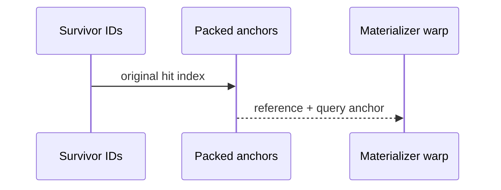
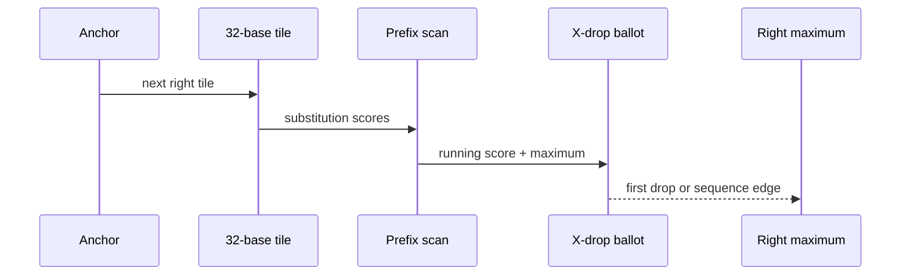
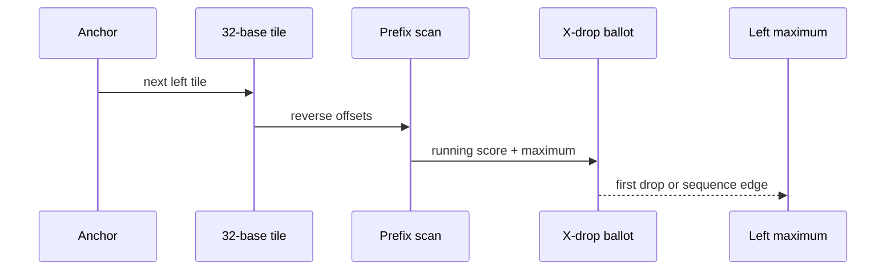
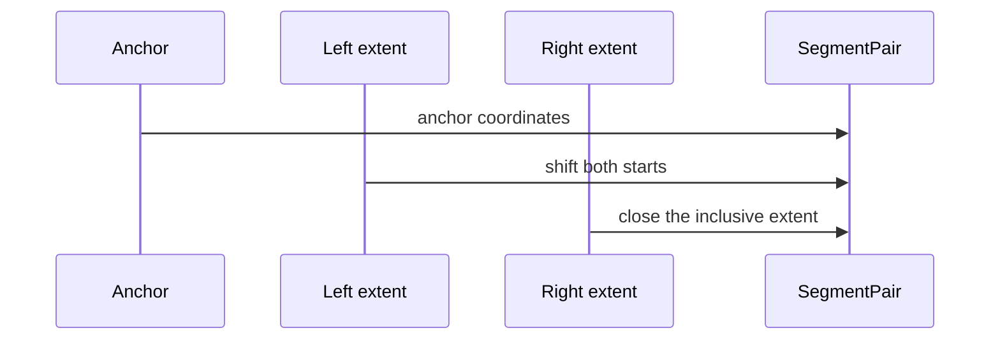
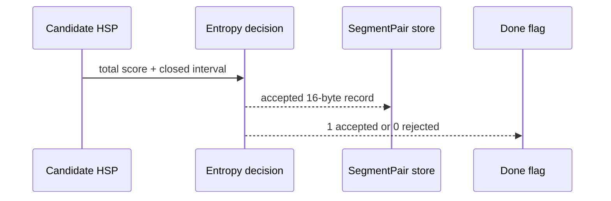

# Materialize exact X-drop HSPs

<!-- @source: src/gpu/kernels.rs::find_hsps -->
<!-- @source: src/hsp.rs::SegmentPair -->

## E.1 — Restore each surviving anchor
<!-- @id: e-restore-anchor -->
WHAT GOES IN: Stable survivor IDs, packed raw anchors, and encoded sequences.
WHAT HAPPENS: One warp resolves each survivor ID back to its original reference/query anchor.
WHAT COMES OUT: An ordered stream of anchors for the exact materializer.
INVARIANT: The materializer sees the same anchor coordinates as the score gate, in the same relative order.

## E.2 — Extend right in warp tiles
<!-- @id: e-right-xdrop -->
WHAT GOES IN: One anchor, the substitution matrix, and X-drop.
WHAT HAPPENS: Thirty-two lanes score consecutive bases, scan prefix sums and maxima, and ballot the first lane beyond X-drop.
WHAT COMES OUT: The right maximum score and earliest position where it occurs.
INVARIANT: An equal later maximum never replaces the earliest winning endpoint.

## E.3 — Extend left with the same rule
<!-- @id: e-left-xdrop -->
WHAT GOES IN: The same anchor and scoring state reset for the left side.
WHAT HAPPENS: Lanes walk bases before the anchor, tile by tile, until the first X-drop or sequence boundary.
WHAT COMES OUT: The left maximum score and earliest left extent.
INVARIANT: Right and left use the oracle's duplicated direction-specific coordinate rules.

## E.4 — Recover the closed HSP interval
<!-- @id: e-interval -->
WHAT GOES IN: Anchor coordinates plus left and right winning extents.
WHAT HAPPENS: The left extent shifts both starts; both directional extents combine into one inclusive length field.
WHAT COMES OUT: Candidate `ref_start`, `query_start`, `len`, and total score.
INVARIANT: `SegmentPair.len` is an extent, so the printed interval covers `start..=start+len`.

## E.5 — Store only accepted records
<!-- @id: e-store -->
WHAT GOES IN: Candidate interval, score, and the entropy-adjusted decision.
WHAT HAPPENS: Lane zero writes one aligned 16-byte SegmentPair and a done flag, or writes rejection status.
WHAT COMES OUT: Materialized HSP/status arrays ready for stable compaction.
INVARIANT: Every active output slot is fully overwritten before the host or another kernel reads it.

