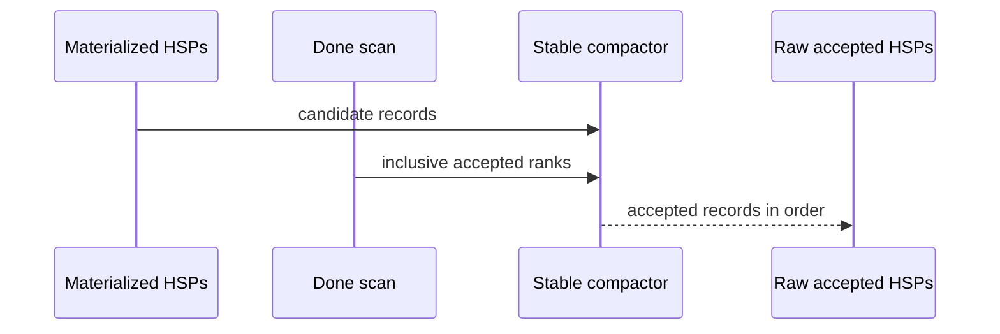
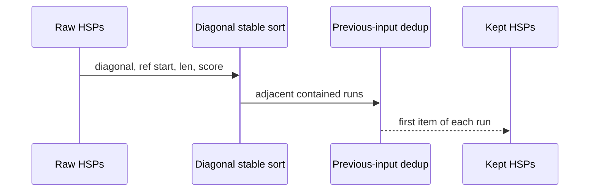
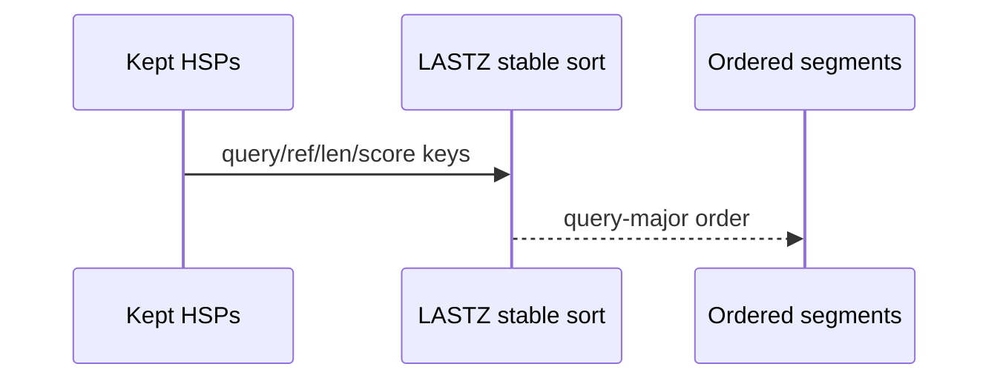
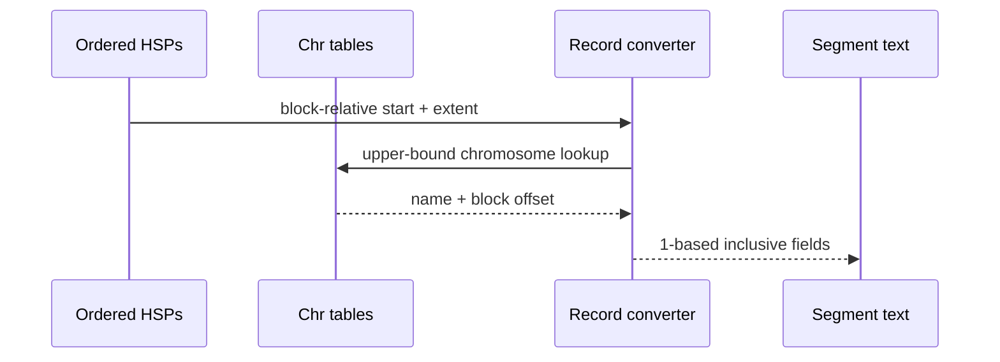
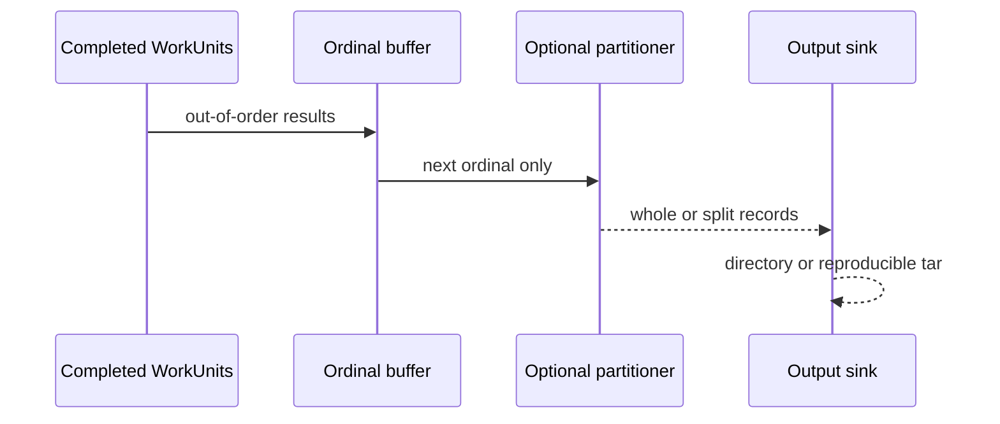

# Accepted HSPs become LASTZ segments

<!-- @source: src/hsp.rs::dedup_and_order -->
<!-- @source: src/hsp.rs::records -->
<!-- @source: src/hsp.rs::render_records -->
<!-- @source: src/run.rs::Emitter::emit_unit -->
<!-- @source: src/partition.rs::Partitioner::plan -->

## G.1 — Compact accepted HSPs
<!-- @id: g-compact -->
WHAT GOES IN: Materialized SegmentPairs and their inclusive-scan done flags.
WHAT HAPPENS: The device copies accepted records into increasing materializer order and the host receives only the active prefix.
WHAT COMES OUT: A dense vector of raw accepted HSPs for one MAX_HITS chunk.
INVARIANT: Compaction changes storage density, never the relative order of accepted records.

## G.2 — Reproduce oracle deduplication
<!-- @id: g-dedup -->
WHAT GOES IN: Raw accepted HSPs from one chunk and strand.
WHAT HAPPENS: A stable diagonal sort makes equivalent runs adjacent; unique-copy compares each record with the previous input record.
WHAT COMES OUT: One survivor for each oracle equivalence run.
INVARIANT: Comparing with the last kept record instead would be wrong because containment is not transitive.

## G.3 — Put survivors in LASTZ order
<!-- @id: g-lastz-order -->
WHAT GOES IN: Deduplicated SegmentPairs.
WHAT HAPPENS: A second stable sort orders query start, reference start, length, then descending score.
WHAT COMES OUT: LASTZ query-major segment order.
INVARIANT: Sort stability and unsigned wrapping diagonal semantics are part of byte parity.

## G.4 — Convert to chromosome coordinates
<!-- @id: g-coordinates -->
WHAT GOES IN: Block-relative SegmentPairs, chromosome tables, and strand.
WHAT HAPPENS: Upper-bound lookup finds each chromosome; starts become one-based and ends remain inclusive. Minus records are traversed in reverse.
WHAT COMES OUT: Eight numeric/text fields for each `.segments` line.
INVARIANT: Coordinate conversion never stitches across the `&` separator between chromosomes.

## G.5 — Emit deterministic files or one archive
<!-- @id: g-emit -->
WHAT GOES IN: Completed WorkUnits arriving in any GPU completion order.
WHAT HAPPENS: Ordinals are replayed; optional diagonal partitioning runs before a directory or reproducible tar sink writes non-empty entries. With `--query-list`, every job has its own ordinal cursor, `-D` history and sink.
WHAT COMES OUT: `tmp<n>.block<q>.r<r>.{plus,minus}[.splitN].segments` files.
INVARIANT: Worker completion order never changes filenames, partition history, archive entry order, or bytes.

