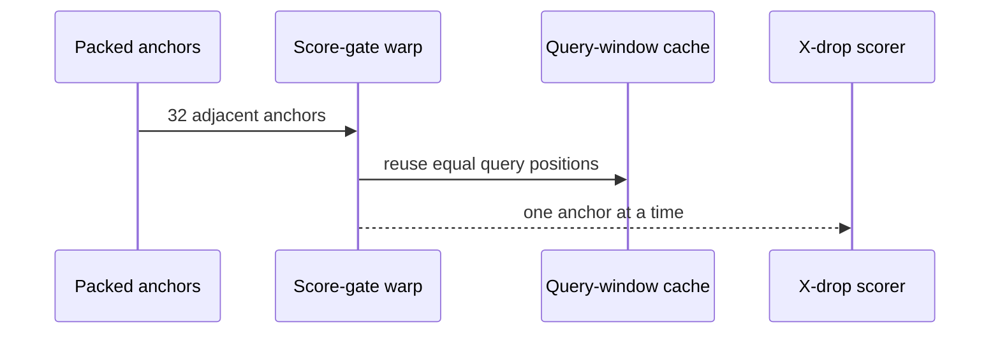
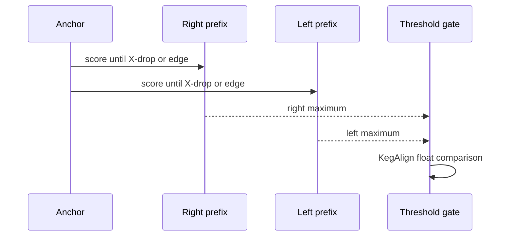
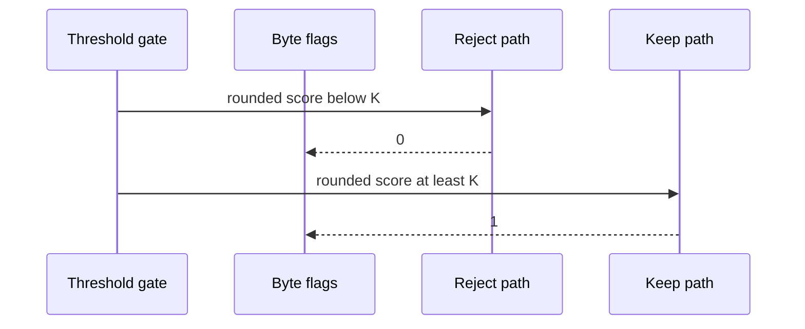
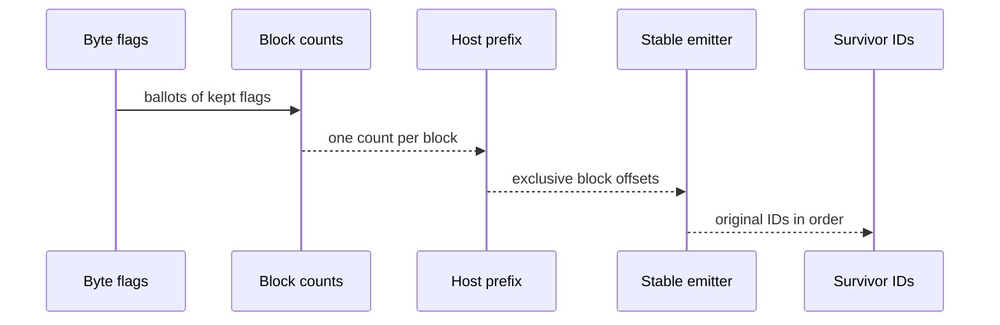

# Reject weak anchors before materialization

<!-- @source: src/gpu/kernels.rs::mark_score_survivors -->
<!-- @source: src/gpu/kernels.rs::count_survivors -->
<!-- @source: src/gpu/kernels.rs::emit_survivors -->
<!-- @source: src/gpu/mod.rs::seed_and_filter -->

## D.1 — Feed coalesced anchor chunks to a warp
<!-- @id: d-coalesced-anchors -->
WHAT GOES IN: Packed `(reference-end, query-end)` anchors in raw hit order.
WHAT HAPPENS: A warp fetches 32 consecutive anchors coalescently and broadcasts one anchor at a time to its lanes.
WHAT COMES OUT: Shared query windows and per-anchor reference coordinates ready for scoring.
INVARIANT: Anchor order and identity are unchanged by the warp's memory mapping.

## D.2 — Compute a score-only X-drop bound
<!-- @id: d-score-only -->
WHAT GOES IN: One anchor, encoded sequences, substitution matrix, and X-drop.
WHAT HAPPENS: Lanes score right and left prefixes, stop on the first X-drop or edge, and retain only the best total score.
WHAT COMES OUT: An upper score for the anchored ungapped segment.
INVARIANT: The threshold value rounds through KegAlign's `f32` conversion before comparison.

## D.3 — Write one byte per decision
<!-- @id: d-flags -->
WHAT GOES IN: The score-only total and hsp threshold K.
WHAT HAPPENS: The common reject path writes zero; plausible anchors write a one-byte survivor flag.
WHAT COMES OUT: A dense flag vector aligned with the original anchor array.
INVARIANT: Rejection creates no HSP record, while every active flag slot is overwritten before reuse.

## D.4 — Compact survivors without reordering
<!-- @id: d-compact -->
WHAT GOES IN: One byte flag per raw anchor.
WHAT HAPPENS: Device blocks count flags, the host scans only block sums, and stable local ranks emit original anchor IDs.
WHAT COMES OUT: A small, increasing list of survivor IDs for full materialization.
INVARIANT: Stable compaction preserves raw hit order exactly, including under forced MAX_HITS chunking.

