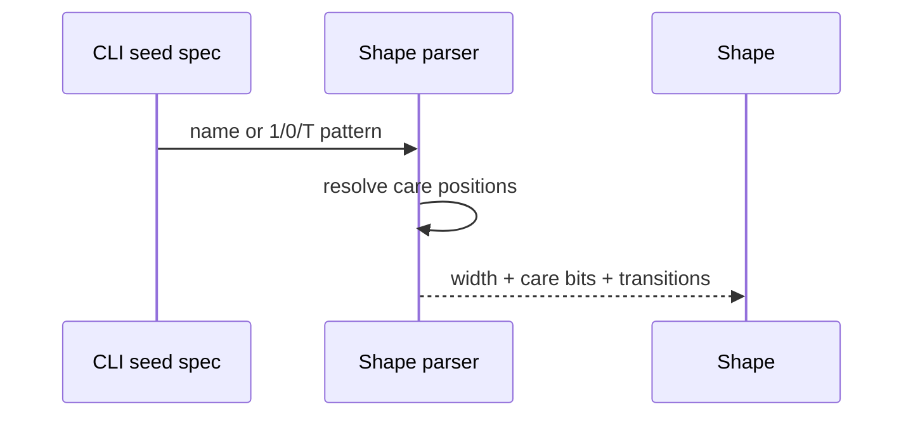
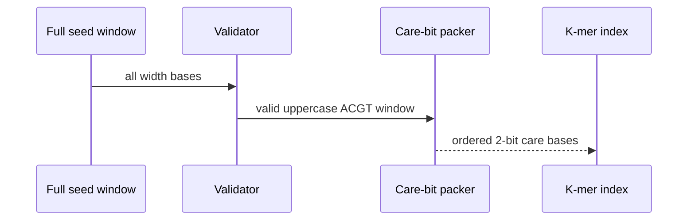
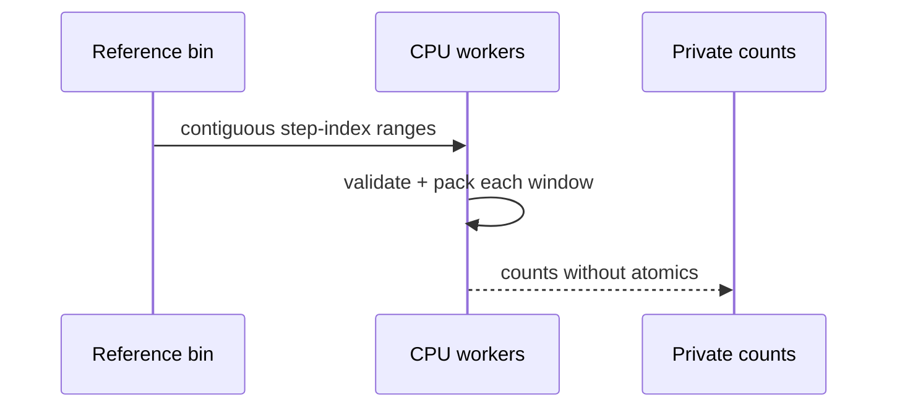
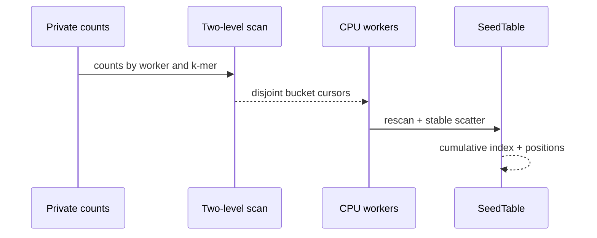
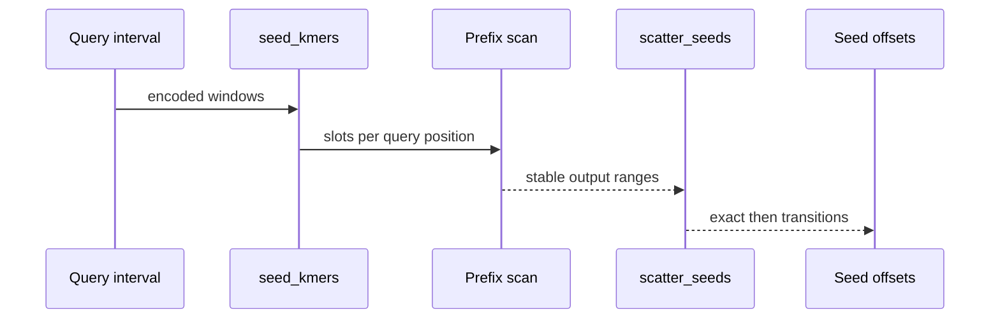

# A stable spaced-seed index

<!-- @source: src/seed.rs::Shape::parse -->
<!-- @source: src/seed.rs::SeedTable::build_parallel -->
<!-- @source: src/gpu/kernels.rs::seed_kmers -->
<!-- @source: src/gpu/kernels.rs::scatter_seeds -->

## B.1 — Resolve the seed shape
<!-- @id: b-shape -->
WHAT GOES IN: `12of19`, `14of22`, or a custom 1/0/T pattern.
WHAT HAPPENS: The parser records the pattern width, care positions, and positions that allow transitions.
WHAT COMES OUT: One validated Shape with 4–15 packed care bases.
INVARIANT: Custom care positions follow KegAlign semantics and therefore admit transitions.

## B.2 — Validate complete seed windows
<!-- @id: b-validate -->
WHAT GOES IN: One Shape and a candidate reference or query start.
WHAT HAPPENS: Every base across the full pattern width is checked before care positions are packed two bits at a time.
WHAT COMES OUT: A packed k-mer index or the invalid-k-mer sentinel.
INVARIANT: An invalid or lowercase base anywhere in the window rejects it, even at a don't-care position.

## B.3 — Count reference k-mers
<!-- @id: b-count -->
WHAT GOES IN: A packed reference bin, Shape, step, and CPU worker count.
WHAT HAPPENS: Workers rescan disjoint position ranges and count each valid k-mer into private tables.
WHAT COMES OUT: Per-worker counts for every possible packed k-mer.
INVARIANT: Reference position zero and the strided starts match KegAlign's offset rule exactly.

## B.4 — Scan and scatter a stable index
<!-- @id: b-scatter -->
WHAT GOES IN: Per-worker k-mer counts and the same reference ranges.
WHAT HAPPENS: Two-level prefixes assign disjoint bucket cursors; workers rescan and scatter genomic positions.
WHAT COMES OUT: Cumulative `index_table` boundaries and bucketed `pos_table` positions.
INVARIANT: Positions remain ascending inside every bucket, byte-identical to the serial builder.

## B.5 — Emit query seeds in oracle order
<!-- @id: b-query-seeds -->
WHAT GOES IN: One query interval, Shape, and transition setting.
WHAT HAPPENS: Each valid position emits its exact k-mer first, then one permitted transition variant per care position.
WHAT COMES OUT: A stable stream of packed `(k-mer, query-position)` seed offsets.
INVARIANT: CPU and device seeders preserve query-position order and variant order exactly.

