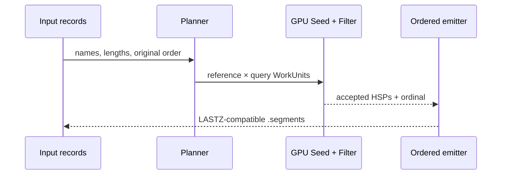
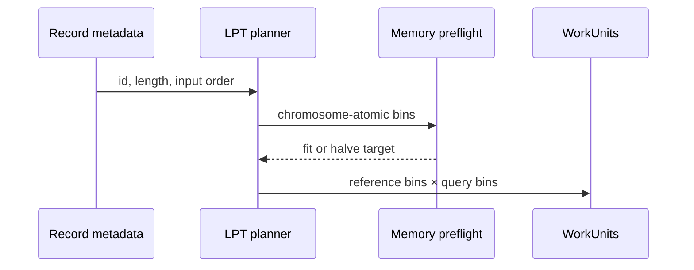
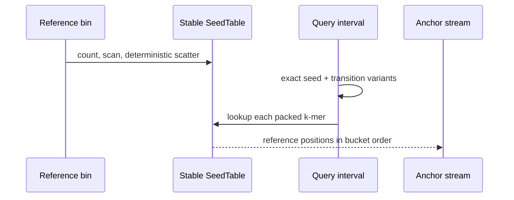
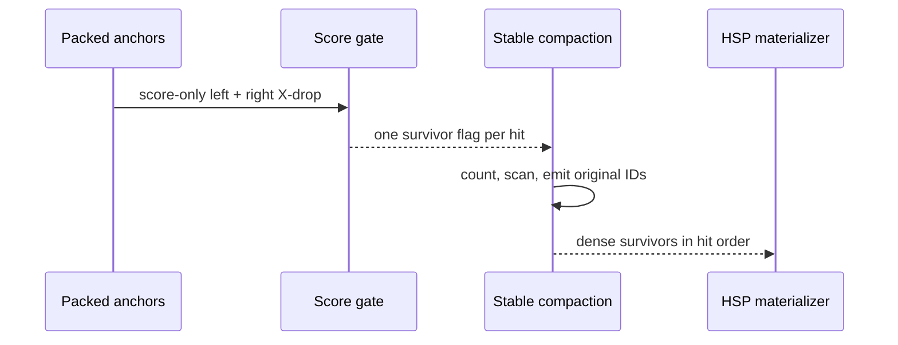
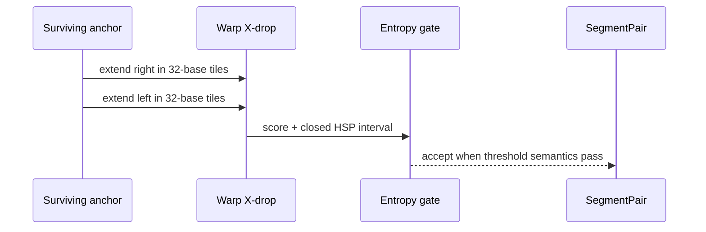
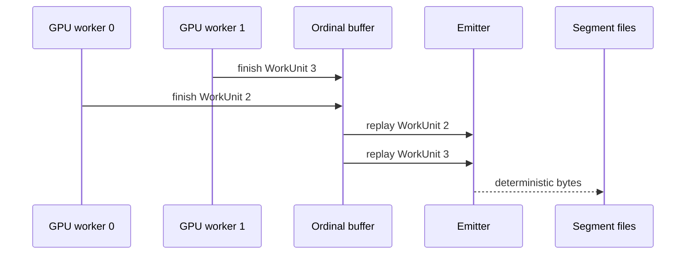

# From genomes to deterministic segment files

<!-- @source: src/run.rs::run -->
<!-- @source: src/plan.rs::plan_within_budget -->
<!-- @source: src/seed.rs::SeedTable::build_parallel -->
<!-- @source: src/gpu/mod.rs::Engine::seed_and_filter -->
<!-- @source: src/gpu/kernels.rs::find_hsps -->
<!-- @source: src/hsp.rs::dedup_and_order -->

## 0.1 — From genomes to segments
<!-- @id: overview -->
WHAT GOES IN: Softmasked FASTA, FASTA.gz, or 2bit reference and query records.
WHAT HAPPENS: hspZ plans chromosome bins, finds seed hits, filters and extends HSPs, then orders them for LASTZ.
WHAT COMES OUT: Non-empty plus/minus `.segments` files or one reproducible tarball.
INVARIANT: Input format does not change the decoded sequence set.

## 0.2 — Plan chromosome-atomic work
<!-- @id: planning -->
WHAT GOES IN: Record metadata, block targets, worker count, and device memory.
WHAT HAPPENS: The planner builds deterministic bins, forms a reference × query grid, and halves unsafe targets.
WHAT COMES OUT: Ordered WorkUnits assigned to GPU workers by reference bin.
INVARIANT: A chromosome is never split to satisfy a target or a memory budget.

## 0.3 — Build and query a spaced-seed index
<!-- @id: seeding -->
WHAT GOES IN: One packed reference bin, one query interval, and a seed shape such as 12of19.
WHAT HAPPENS: Reference positions are scattered into stable buckets; exact and permitted transition query seeds look them up.
WHAT COMES OUT: A cumulative stream of reference/query anchor positions.
INVARIANT: Full seed windows containing an invalid base are rejected, and reference bucket order is stable.

## 0.4 — Reject weak hits before materialization
<!-- @id: filtering -->
WHAT GOES IN: Packed anchors in exact hit-stream order.
WHAT HAPPENS: A score-only X-drop gate marks plausible anchors; scans compact survivor IDs without reordering them.
WHAT COMES OUT: A dense list of the rare anchors worth full extension.
INVARIANT: Compaction preserves the original hit order and MAX_HITS chunk scope.

## 0.5 — Recover exact HSPs and apply entropy
<!-- @id: xdrop-entropy -->
WHAT GOES IN: A surviving anchor and the encoded reference/query sequences.
WHAT HAPPENS: One warp finds right and left X-drop maxima, recovers boundaries, and conditionally recounts matching bases for entropy.
WHAT COMES OUT: An accepted SegmentPair with exact endpoints and score, or rejection.
INVARIANT: Earliest-maximum ties and KegAlign float conversion points are preserved.

## 0.6 — Make multi-GPU completion deterministic
<!-- @id: deterministic-output -->
WHAT GOES IN: WorkUnits distributed across independently finishing GPU workers.
WHAT HAPPENS: Results enter an ordinal buffer, then one emitter performs host dedup, LASTZ ordering, coordinate conversion, and optional partitioning.
WHAT COMES OUT: The same bytes for one or many GPUs within the same layout.
INVARIANT: Worker completion order never controls file order or partition history.

